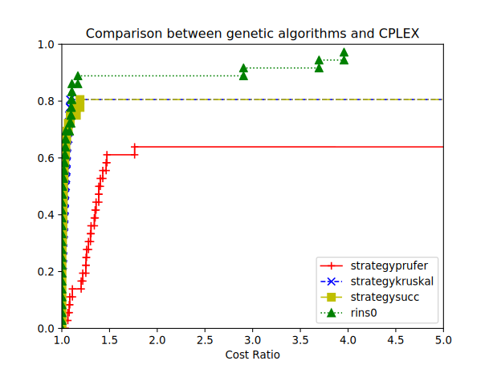

# Operations Research 2 class

During this course, we were asked to use discrete optimization to minimize the cost of building an offshore wind farm. In particular, given that the wind turbines and the substations are placed (fixed) inside, we were asked to optimize its cable routing.

During the couse, we have compared CPLEX against genetic algorithms. We have designed and implemented with our professor a genetic algorithm with encoding structure able to solve the problem. The results have proved that the "free" approach can allow to reach solutions close to CPLEX. This allows to save the license costs of the IBM's software.

  

